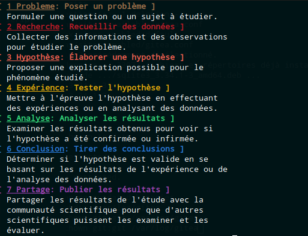

# scientific-method
Scientific method helpers, and stuff i make mainly for my niece and I. 

## scientific method bash script



```bash
#!/bin/bash
METHOD=$(cat << 'EOF'
1,Probleme,Poser un problème,Formuler une question ou un sujet à étudier.,33
2,Recherche,Recueillir des données,Collecter des informations et des observations pour étudier le problème.,31
3,Hypothèse,Élaborer une hypothèse,Proposer une explication possible pour le phénomène étudié.,91
4,Expérience,Tester l'hypothèse,Mettre à l'épreuve l'hypothèse en effectuant des expériences ou en analysant des données.,93
5,Analyse,Analyser les résultats,Examiner les résultats obtenus pour voir si l'hypothèse a été confirmée ou infirmée.,92
6,Conclusion,Tirer des conclusions,Déterminer si l'hypothèse est valide en se basant sur les résultats de l'expérience ou de l'analyse des données.,94
7,Partage,Publier les résultats,Partager les résultats de l'étude avec la communauté scientifique pour que d'autres scientifiques puissent les examiner et les évaluer.,35
EOF
)
FMT_U=$(tput smul)
FMT_NU=$(tput rmul)
FMT_BD=$(tput bold)
FMT_RST=$(tput sgr0)
IFS=$','
while read ETAPE MOTCLE TITRE DESC COLOR;
do
COL=$(echo -e "\e["${COLOR}"m")
echo ${COL}${FMT_BD}"[ "${FMT_U}${ETAPE}" "${MOTCLE}${FMT_NU}": "${TITRE}" ]"${FMT_RST}
IFS=$'\n'
FOLDESC=$(echo ${DESC} | fold -s -w 50)
for i in ${FOLDESC}; do 
	echo "| ${i}"
done
IFS=$','
done <<< $METHOD
```

